# 排列与组合

## 排列

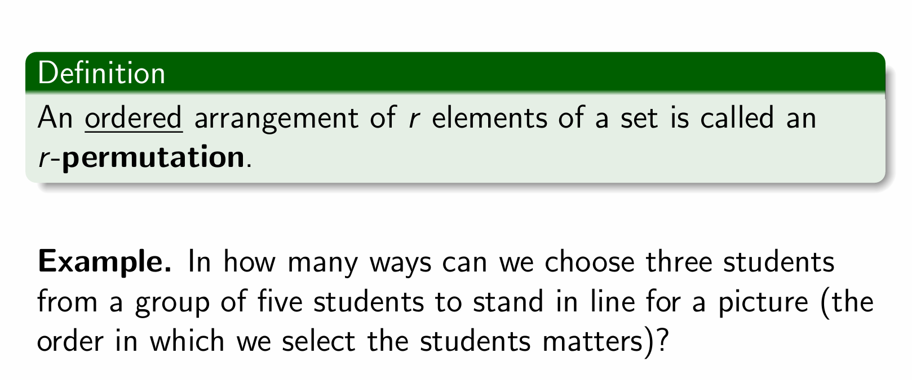

## 复习

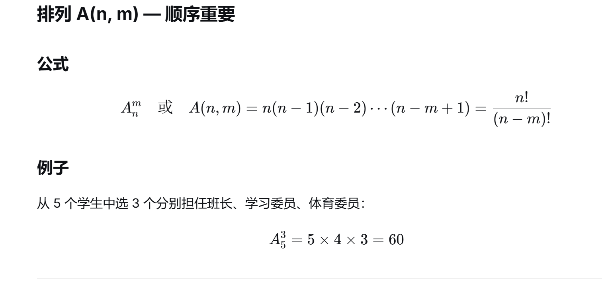

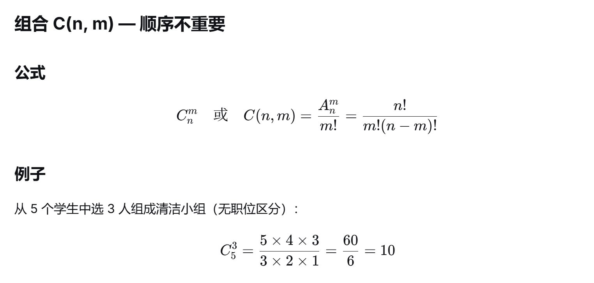

## 二项式系数之和

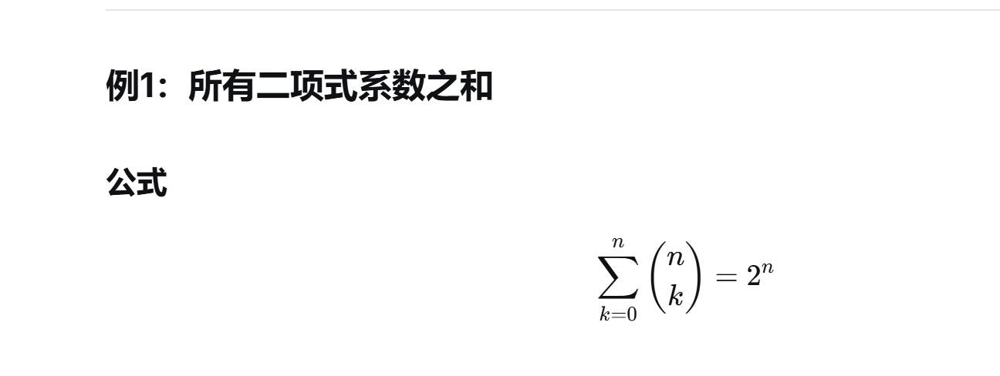

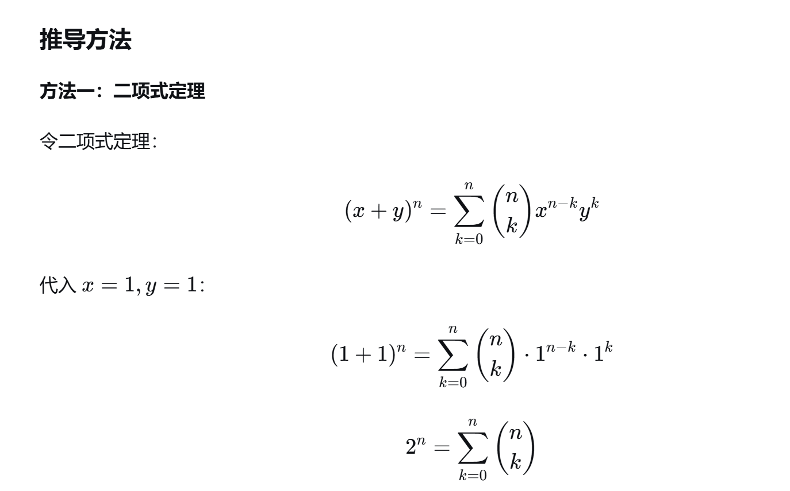

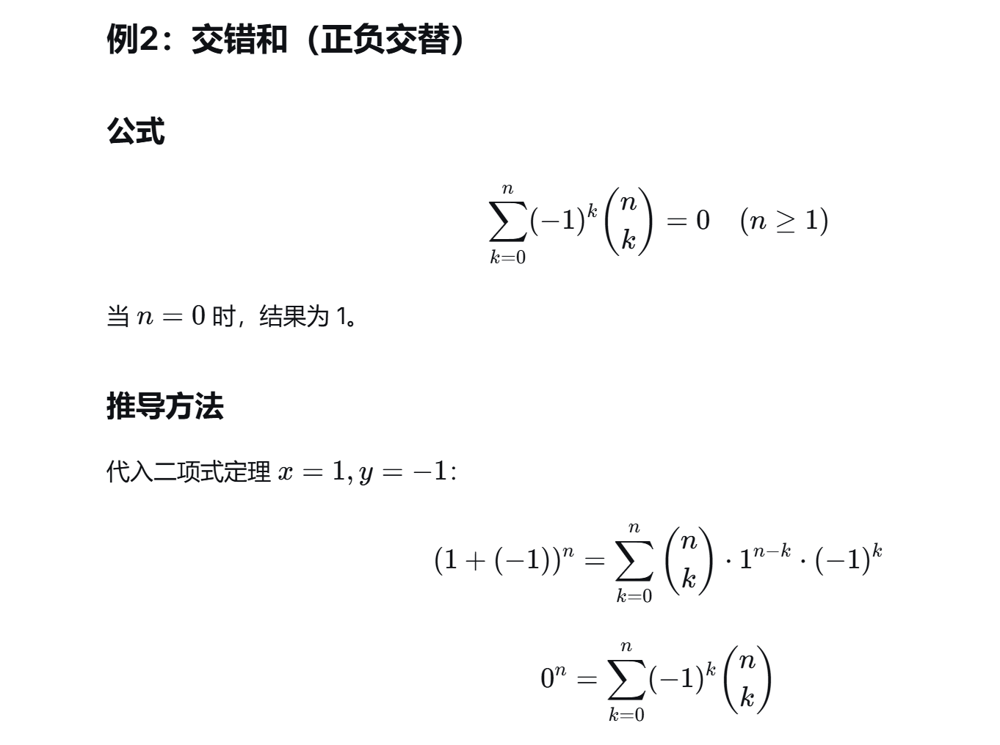

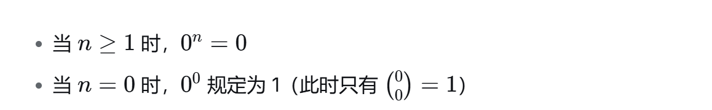

## 二项式系数递推式

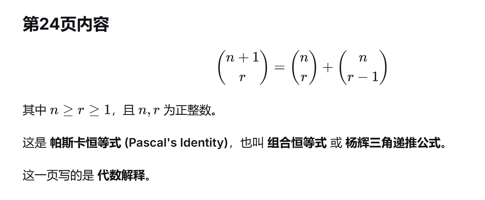

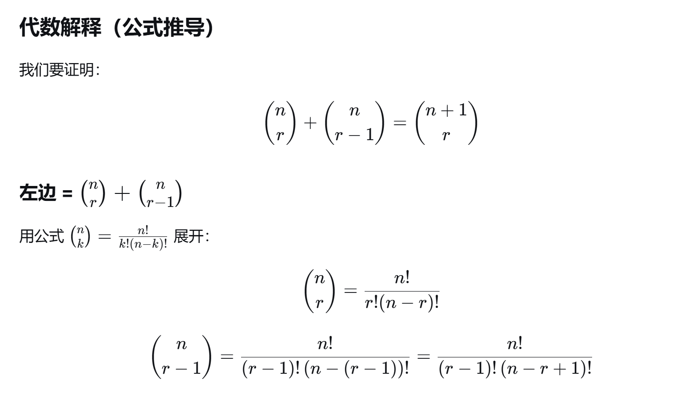

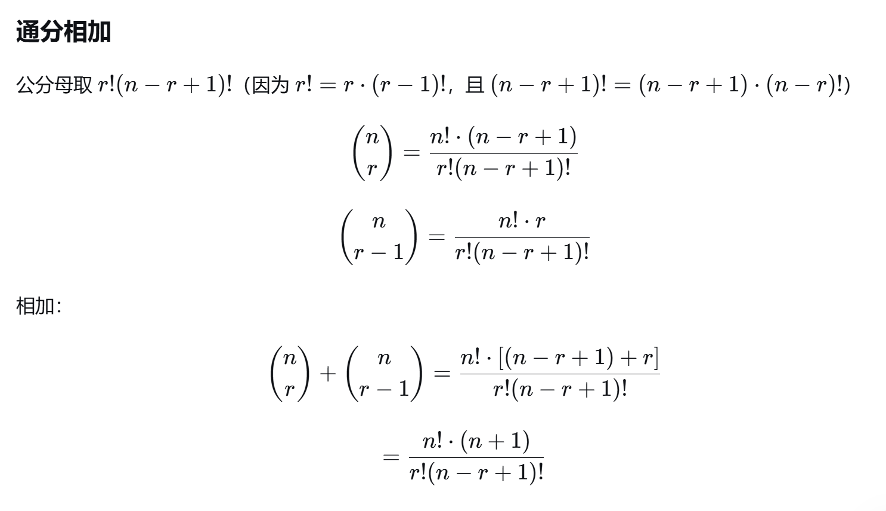

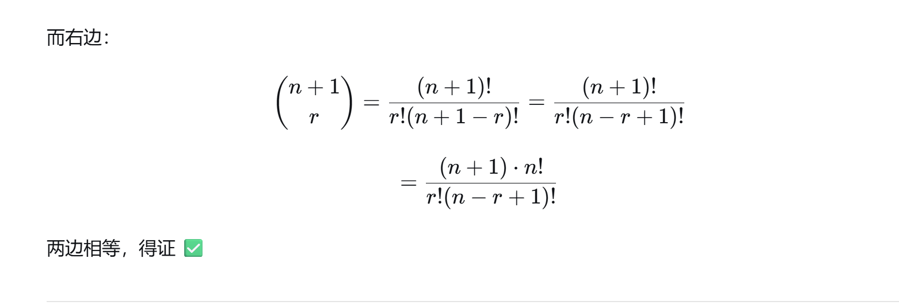

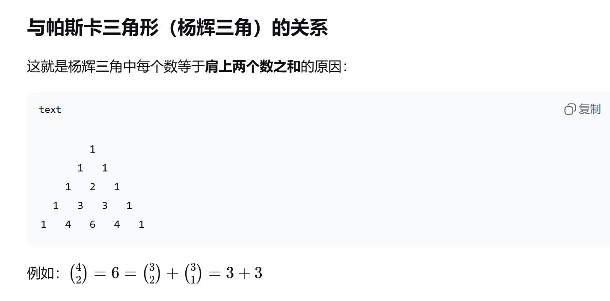

## 隔板法

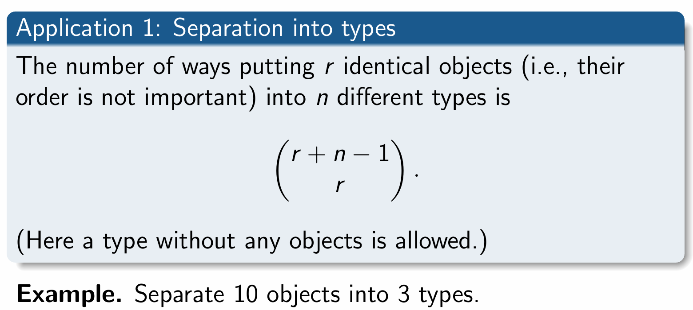

### 举个例子

10个东西，3个盒子

#### 允许空盒

直接

C(12,2)

为什么？12怎么来的，12就是10+3-1，也就是公式里的n+r-1

2怎么来的？3个盒子，是不是就2个板子？

#### 不允许空盒

直接插板，10个东西，插板只能插中间，那就是9个空，3个板，C（9,3）

## 多项式系数

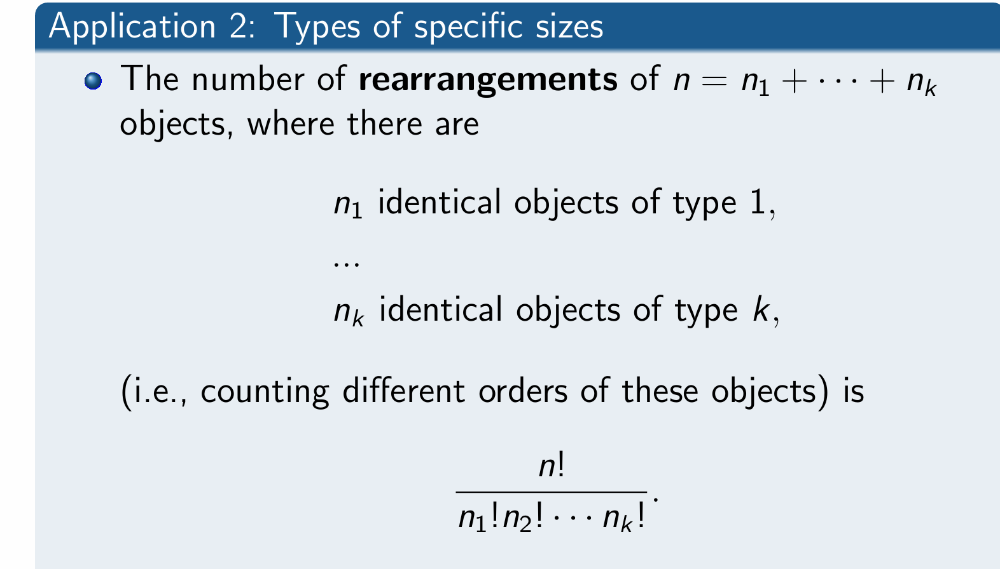

#### 多项式的系数

#### 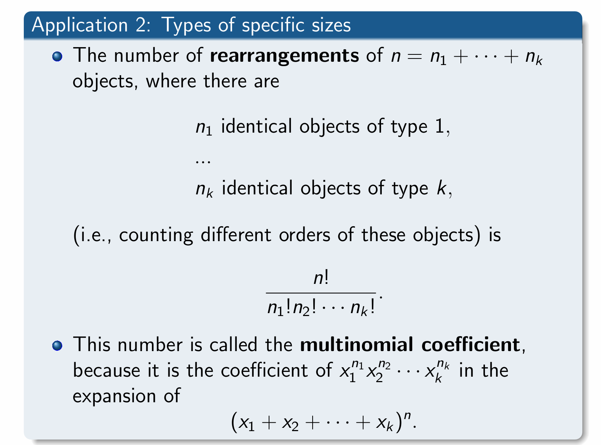

#### 多项式定理

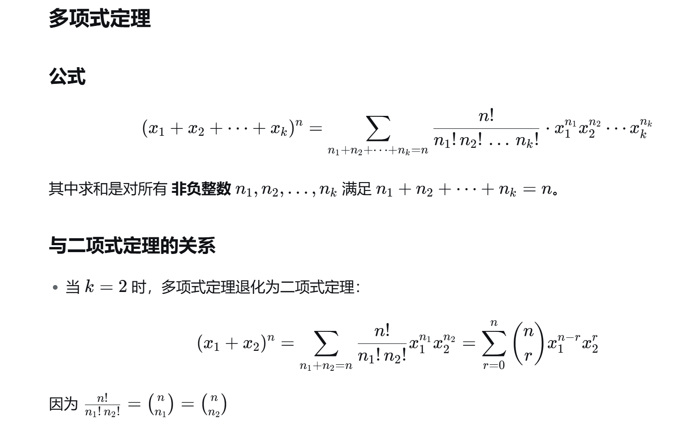

#### 例子

#### 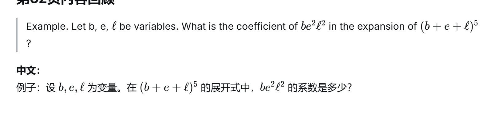

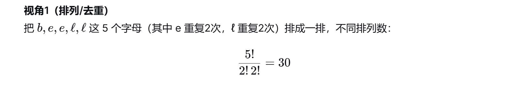

## 去重

你忘了吗，

要记得去重

## 分组分配

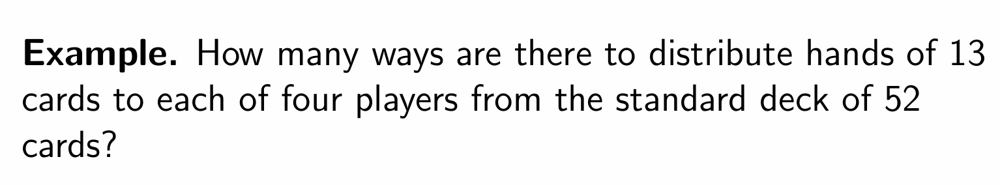

> 直接就是C（52,13）*C（39,13）*C（26,13）C（13,13）
>
> ​    

好吧，然后化成阶乘的样子，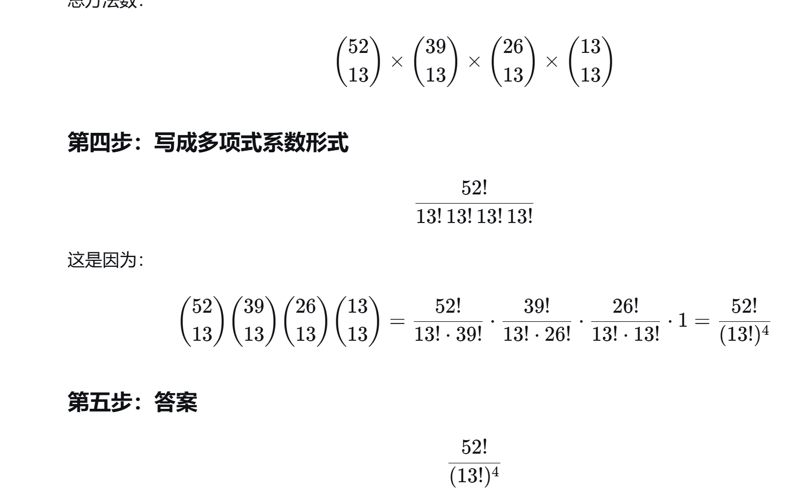

##### 例子

一样的

> C（52,5）C（47,5）C(42,5)C（37,5）

就行了