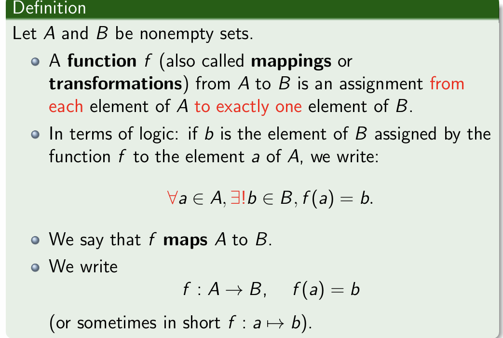
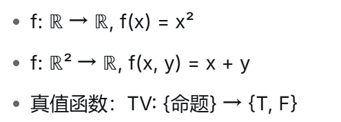
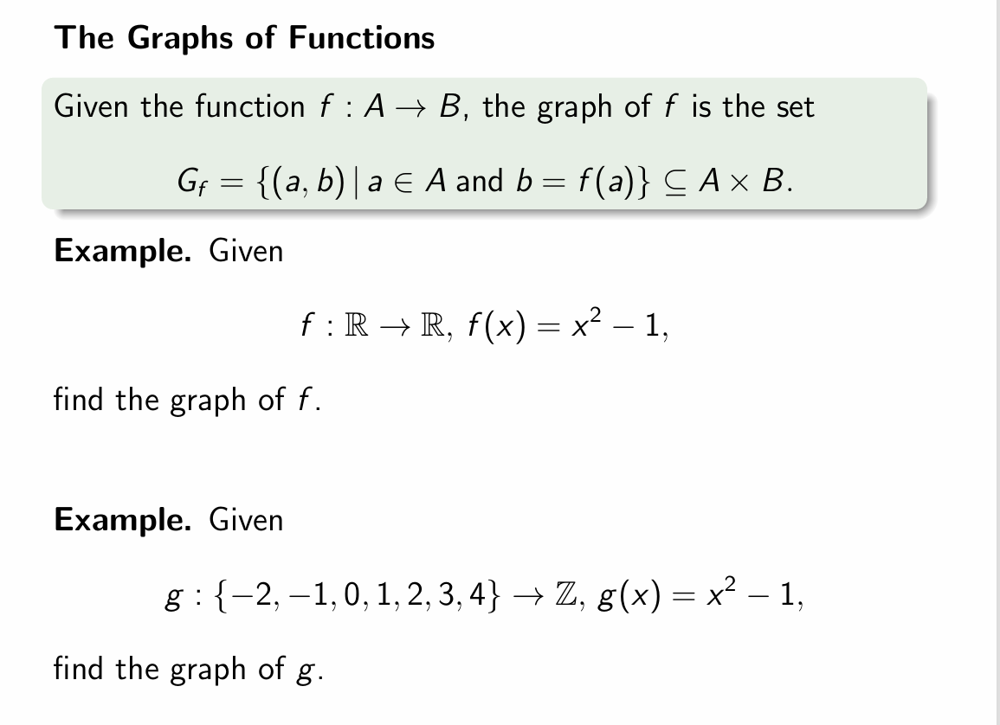
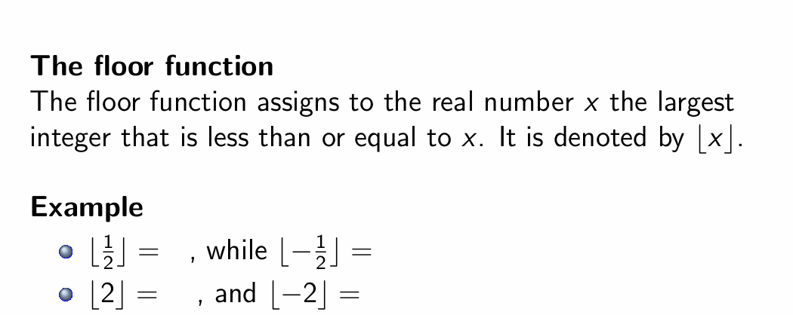
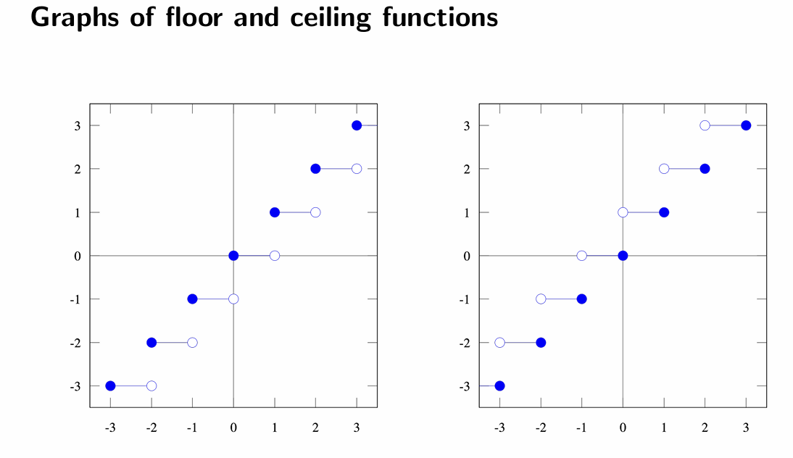
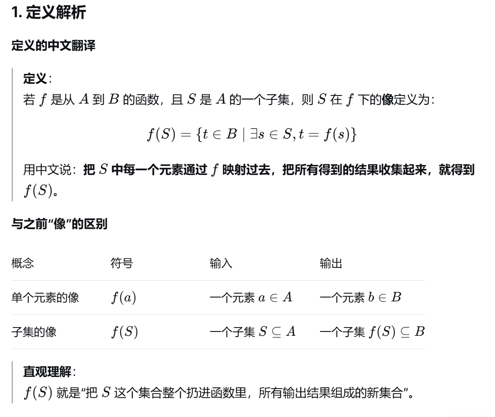

# 函数

## 定义

### 例子

## 定义域与陪域;像与原像

### 定义

陪域(codomain)≠值域(image)

简单来说：**陪域是预定的“目标范围”，值域是实际到达的“真实范围”**

- **陪域**：函数 `f: A → B` 中，集合 `B` 就是陪域。它是在定义函数时**事先设定好的**，表示所有可能输出的“候选值”所在的集合。它是一个**上界**。
- **值域**：也记作 `f(A)`，是 `A` 中所有元素经过 `f` 映射后，**实际得到的**输出值的集合。它是陪域的一个子集。

### 关键关系

> **值域 ⊆ 陪域**

- 值域**永远**是陪域的子集（或等于陪域）。
- 只有当函数是**满射**时，值域才 **等于** 陪域。

#### 例子

## 可以定义实值函数的加法、减法、乘法

### 例子

## 复合函数

## 函数图像

## 向下取整函数

## 向上取整函数

## 二者图像

## 子集的像

### 例题的解答

## 子集的原像

### 与像的对比

