## 计算机网络的分层结构

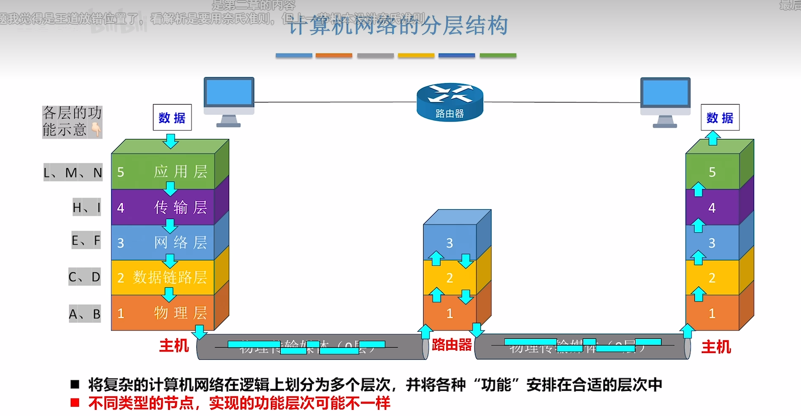

- 要求功能设计合理

## 三种常见的结构

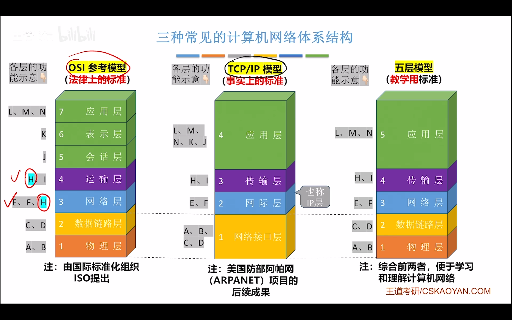

## 什么是网络体系结构？

只需要知道分为几层？

需要哪些功能？

这些功能由哪些协议来实现？

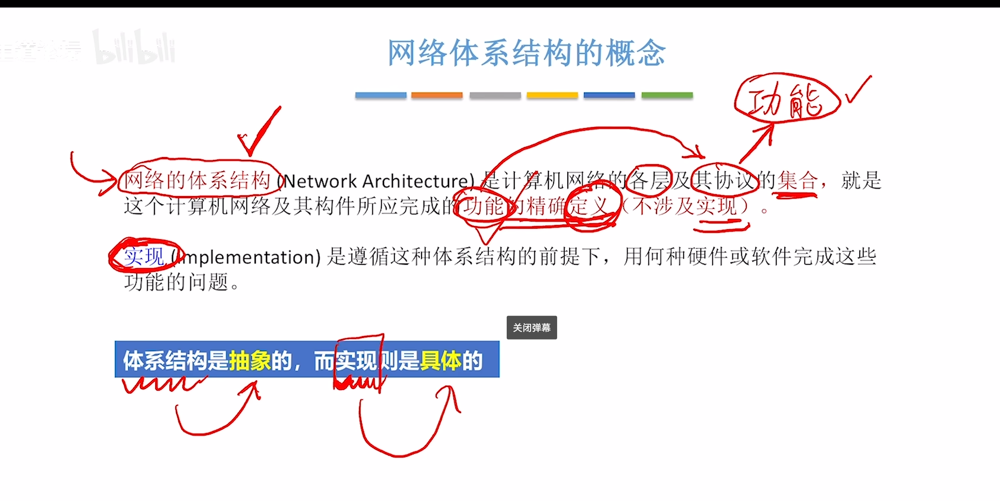

## 各层内部的功能实体，关系？（水平视角）

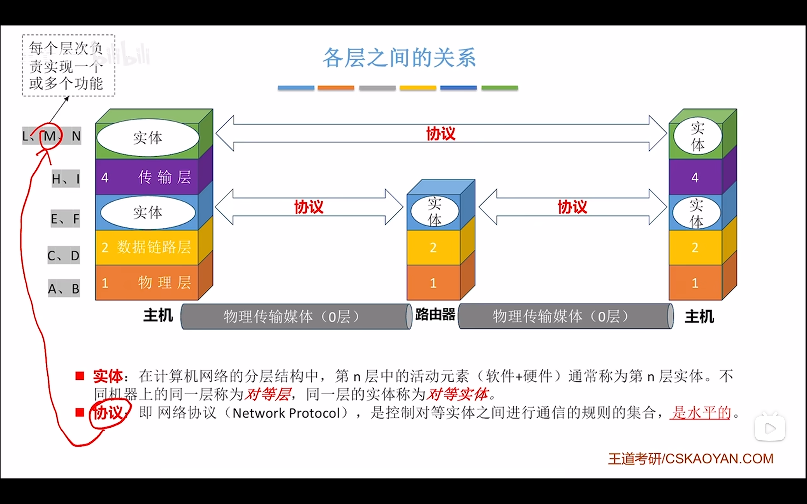

## 接口与服务（垂直视角）

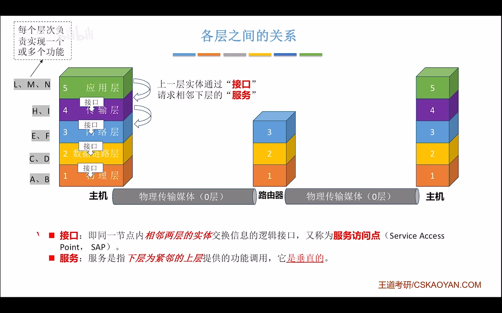

### 数据的传输，举个例子

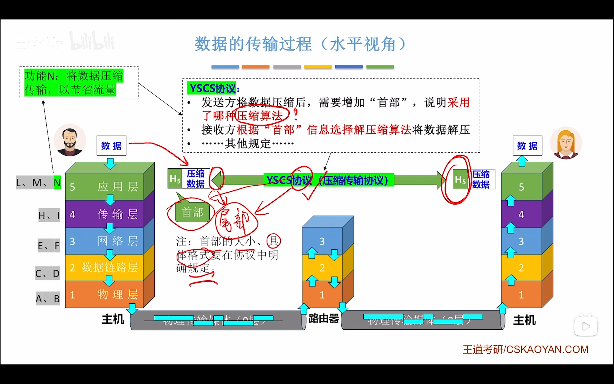

### 1.逐层加码，加入一些头部，尾部控制信息

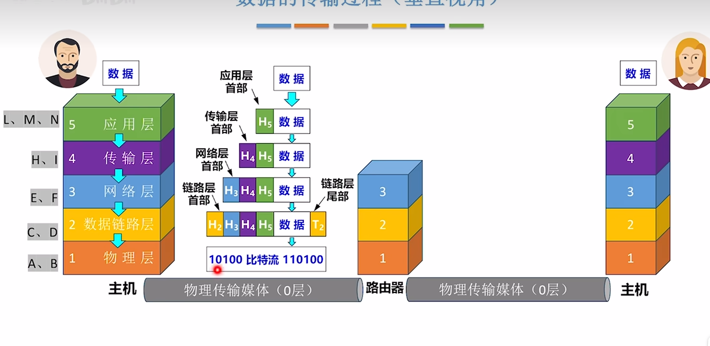

### 2.路由的接收，存储

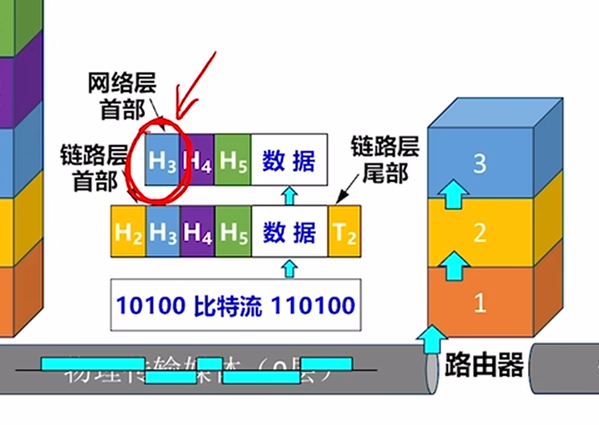

逐层检查，差错控制等等。。。。

### 3.路由的处理

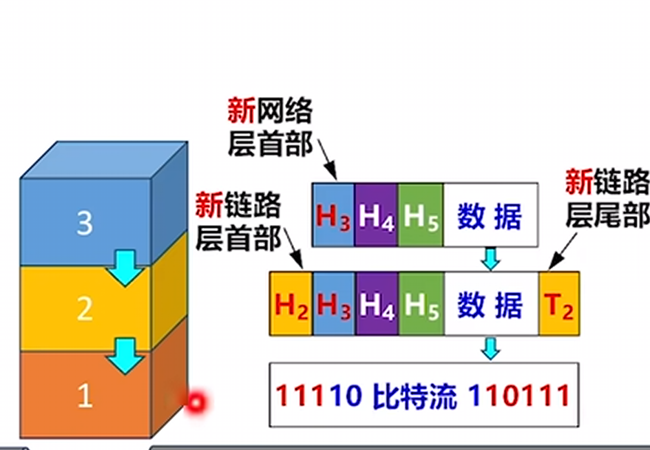

### 4.交给用户

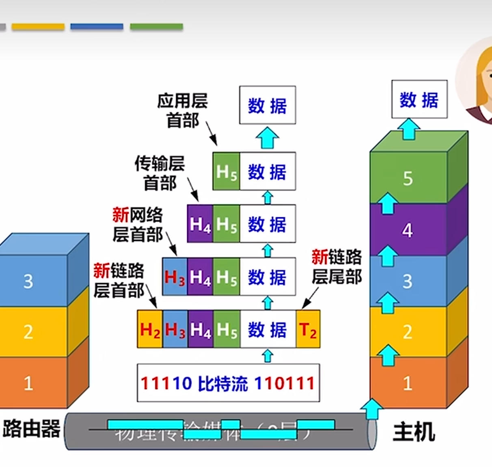

## 数据单元

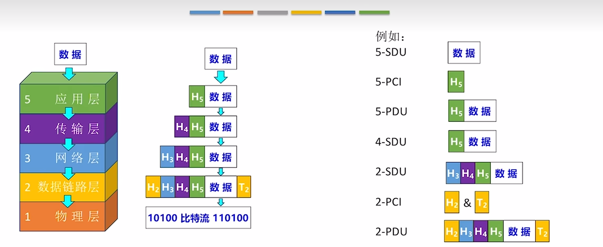

## 协议的三要素

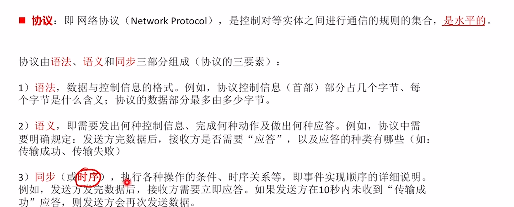

